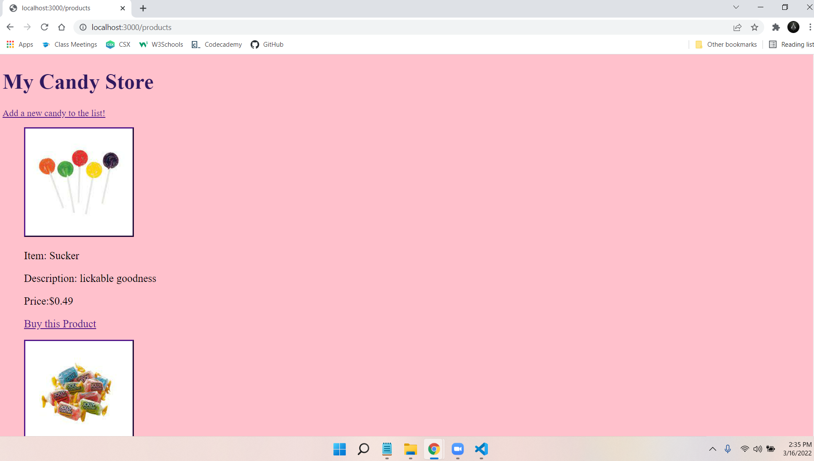
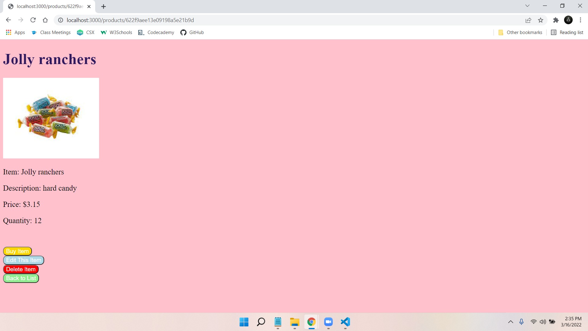

*--Mongoose store - Project #2--* 

I wanted to create a store where candy can be bought and added back. I seeded it with my kid’s favorite candy at the moment. 

 

--Application Function--

This is CRUD project that allows a user to view, add, delete, and edit candy. The picture can be clicked on to take you to the candy page where it can be bought until it is out of stock. Then you can return to the main page that has all the items listed. 

 

--Technologies used to build my candy store--

* HTML5 

* CSS 

* JavaScript 

* Express.js 

* Mongoose  

* MongoDB 

* Heroku 

--How to install my candy store and run it locally--

You will need to navigate to this repository and fork and clone it to your machine 

Here is the link: https://github.com/TonyFord2002/mongoose_store.git 

Once it is on your machine you will need to change into the correct directory and install the following from your terminal: 

* npm init -y 

* npm i express 

* npm i dotenv 

* npm i mongoose 

* npm i method-override 

* npm i  express-react-views react@16 react-dom@16 –save

You will need to create a .env file and fill it with

* MONGO_URI=<your MongoDB information goes here>
* PORT=<your chosen port to use>

After those steps are complete you can now type 

* nodemon 

That will open the link to MongoDB using mongoose and will allow you to run my store on localhost:3000 or your chosen port from your .env file. 

It should look something like this:

This is what the individual candy page should look like:

In a second terminal you will need to enter 

* node seeds.js 

It will prepopulate the store with 6 candies and all their information. 

You are now ready to have fun with my store! Enjoy it and add your favorite candy to the list!